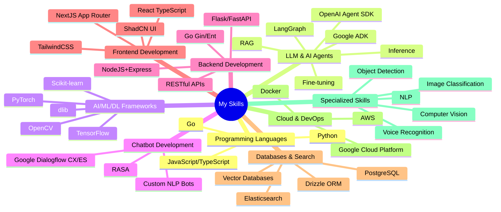

<h1 align="center">Hi 👋, I am Raj Kapadia</h1>

  
   
  <h3 align="center">AI/ML Engineer | LLM Specialist | Full-Stack Developer</h3>
  
<i>Fulltime Freelancer with 7+ years of IT industry and freelance experience</i>

### About Me

I'm a passionate AI/ML engineer and full-stack developer with **7+ years of experience** in building cutting-edge AI solutions. My expertise spans across **LLM fine-tuning and inference**, **AI Agent development**, and end-to-end application development. With a strong background in both academia (former Assistant Professor) and industry, I bring a unique perspective to solving complex technical challenges.

**Key Highlights:**
- 🤖 Specialized in LLM inference, training, and application development
- 🎯 Built **100+ chatbots** on Google Dialogflow ES/CX for clients worldwide
- 👥 Led AI/ML teams as Team Lead at Let's Enkindle (2023-2025)
- 🎓 Former Assistant Professor teaching Electrical Engineering
- 📹 Part-time YouTuber creating content on AI/ML, NLP, and LLMs
- 🌟 Top-rated freelancer on Fiverr and Upwork

---

## 💼 Professional Experience

### Team Lead AI & ML | Let's Enkindle
**September 2023 – April 2025**
- Led a team of 5 developers in building end-to-end AI/ML/DL products
- Developed **Text-to-SQL application** powered by LLM and NLP, connected to WhatsApp for real-time database queries in natural language
- Created **LLM fine-tuning and inference pipelines** for production use
- Built **image similarity search engine** for tile manufacturer with large-scale database

### Lead AI & ML Developer | The Other Fruit/Nes Tech Ltd
**January 2022 – August 2023**
- Led team of 3 developers in developing innovative AI/ML solutions
- Developed **image similarity search engine** with auto-scraping and comparative generation using TensorFlow, Elastic, and OpenCV
- Built **face recognition biometric authentication** system using dlib
- Created **voice-as-password** two-factor authentication system
- Developed **toxic comment classifier** using PyTorch
- Built full-stack SaaS platforms using NextJS, ShadCN, TailwindCSS, Drizzle, and PostgreSQL

---

## 🎯 Core Expertise

* 🤖 **AI Agents Development** - LangGraph, OpenAI Agent SDK, Google ADK
* 🧠 **Large Language Models** - Fine-tuning, Inference, Application Development
* 💬 **Chatbot Development** - Dialogflow CX/ES, RASA
* 🔌 **API Development** - Python (Flask, FastAPI), NodeJS+Express (TypeScript, JavaScript), Go (Gin, Ent)
* 🌐 **Fullstack Development** - NextJS, React, TypeScript, ShadCN, TailwindCSS
* 🖼️ **Computer Vision** - Image Classification, Object Detection, Image Search
* 📝 **Natural Language Processing** - Text Classification, NLP Pipelines
* ☁️ **Cloud Platforms** - GCP, AWS

---

## 🚀 Featured Projects

### LLM-Powered Applications
- **Text-to-SQL WhatsApp Bot** - Natural language database queries via WhatsApp
- **LLM Fine-tuning Pipeline** - Custom model training and deployment system
- **AI Agent Systems** - Complex task automation using LLMs

### Computer Vision
- **Image Similarity Search Engine** - Large-scale image retrieval with auto-scraping
- **Face Recognition System** - Biometric authentication using deep learning
- **Object Detection Pipeline** - End-to-end training and deployment

### NLP & Text Analysis
- **Toxic Comment Classifier** - Content moderation using PyTorch
- **Voice Authentication** - Voice-as-password 2FA system

### Fullstack Applications
- **SaaS Platforms** - Production-ready applications with NextJS stack
- **100+ Dialogflow Chatbots** - Custom conversational AI solutions

---

## 🎓 Freelance Success

With a strong presence on **Fiverr** and **Upwork**, I've successfully delivered **100+ Google Dialogflow ES/CX chatbot projects** to clients worldwide, using NodeJS and Python backends. My work spans various industries and use cases, from customer support to complex conversational AI systems.

 

---

## 📫 Connect With Me

  
  
  
  
  
  

---

## 🛠️ Tech Stack

---

## 📊 GitHub Stats

  
  

  

  

---

## 📺 YouTube Content

I regularly share tutorials and insights on:
- Google Dialogflow ES/CX
- Large Language Models (LLMs)
- Machine Learning & Deep Learning
- Natural Language Processing
- AI/ML Project Development
- API Development

[Subscribe to my YouTube channel](https://www.youtube.com/channel/UCOT01XvBSj12xQsANtTeAcQ) to stay updated with the latest content!

---

## 🎓 Education

**Master of Engineering** - Power System (CPI: 8.3)
*Sankalchand Patel College of Engineering, Visnagar, Gujarat* | 2011-2013

**Bachelor of Engineering** - Electrical Engineering (67%)
*Global Institute of Technology, Jaipur, Rajasthan* | 2006-2009

---

  <i>💡 "Combining academic excellence with industry expertise to build innovative AI solutions"</i>

  <i>⚡ Open to exciting freelance projects and collaborations!</i>

