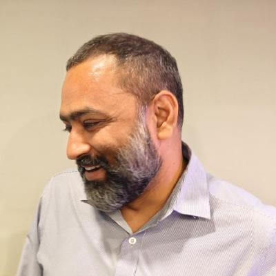
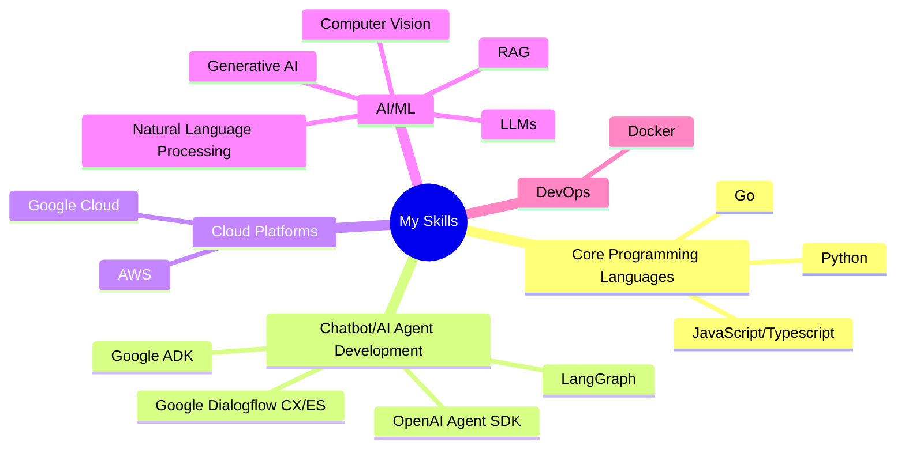

<h1 align="center">Hi 👋, I am Raj Kapadia</h1>

  
   
  <h3 align="center">Electrical Engineer & Fullstack Developer</h3>

I am an Electrical Engineer with a Master's Degree in Electrical Power System, passionate about coding. I love playing guitar and am a full-time freelancer.

## My interests are:
* AI Agents development (LangGraph, Openai Agent SDK, Google ADK)
* Large Language Models
* Chatbot development using Dialogflow CX/ES, RASA
* RESTful API development Python (Flask, FastAPI), NodeJS+Express (Typescript, Javascript) and Go (Gin, Ent)
* Fullstack application development using Nextjs, Typescript, Shadcn, TailwindCSS
* Computer Vision, Natural Language Processing, and Machine Learning projects

 

## Portfolio Website
<a href="https://www.rajkapadia.com" target="_blank">
  Visit my portfolio website
</a>

## You can contact me here:

 
 

## Tech Stack

 

 

 
 

