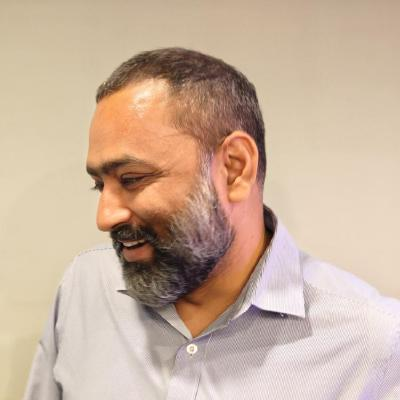

# Raj Kapadia

### AI Agent & Applied LLM Engineer · Founder of TrishiAI · Creator of Calorie Buddy AI

I build production AI agents, conversational systems, and full-stack AI products with Python, TypeScript, OpenAI, LangGraph, FastAPI, PostgreSQL, and Docker.

## What I am building

### [Calorie Buddy AI](https://caloriebuddy.trishiai.com)

**Creator and lead developer** of a Telegram-first nutrition and fitness product that turns everyday conversations into useful tracking.

- Log meals through text, food photos, and voice notes.
- Track workouts from messages and exercise-summary screenshots.
- Review AI estimates before anything is saved.
- Follow calories, macros, weight, daily progress, and weekly or monthly summaries.
- Configure optional reminders that arrive in the user's local timezone.
- Operate the product through a TypeScript monorepo with a Telegram bot, background workers, public Next.js site, protected admin dashboard, PostgreSQL, Redis, and Docker.

[Explore the product](https://caloriebuddy.trishiai.com) · [Open the Telegram bot](https://t.me/CalorieBuddyAI_Bot)

### [TrishiAI](https://trishiai.com)

I founded TrishiAI to help companies design and ship AI agents and conversational products for real operational workflows. The work spans agent architecture, retrieval, tools, guardrails, evaluations, Google conversational platforms, integrations, and production delivery.

[Explore TrishiAI](https://trishiai.com) · [View my consulting portfolio](https://rajkapadia.com)

## Selected engineering work

### [YouTube Animation Generator](https://github.com/RajKKapadia/youtube-animation-generator)

A TypeScript and Remotion CLI for grounded narrated videos and editor-ready animation overlays. It combines structured planning, optional cited research, local voice synthesis, source-backed charts, deterministic media handling, and native 16:9 and 9:16 rendering.

`TypeScript` `Remotion` `OpenAI` `Structured Outputs` `Local TTS`

### [AI Invoice Processing Backend](https://github.com/RajKKapadia/ai-invoice-processing-backend)

A multimodal invoice workflow with deterministic financial validation, durable LangGraph checkpoints, background processing, and human approval or correction. The model extracts data; application rules decide whether an invoice is safe to auto-approve.

`Python` `FastAPI` `LangGraph` `Celery` `PostgreSQL` `MinIO`

### [YouTube AI Knowledge Base](https://github.com/RajKKapadia/youtube-ai-knowledge-base)

A Dockerized ingestion and retrieval backend that transcribes YouTube videos locally, indexes timestamped chunks, and returns grounded search results or answers with direct source links.

`Python` `FastAPI` `Celery` `Whisper` `Qdrant` `PostgreSQL`

### [Same Agent in Three Frameworks](https://github.com/RajKKapadia/LangGraph-vs-Google-ADK-vs-OpenAI-Agents-SDK)

The same task-manager agent implemented with OpenAI Agents SDK, LangGraph, and Google ADK while sharing one tool layer and task store. This makes the orchestration differences concrete and comparable.

`OpenAI Agents SDK` `LangGraph` `Google ADK` `Python`

### [AI Agent Platform](https://github.com/RajKKapadia/ai-agent-platform)

A full-stack platform for creating and operating AI agents with RAG, MCP tool integrations, encrypted credentials, user and admin applications, and a PostgreSQL-backed runtime.

`TypeScript` `Next.js` `Express` `MCP` `PostgreSQL` `Turborepo`

### [WhatsApp + Google Conversational Agents](https://github.com/RajKKapadia/Google-Conversational-Agents-WhatsApp-Python)

A FastAPI webhook system connecting WhatsApp with Google Conversational Agents and Gemini. Redis-backed background processing lets Meta webhooks return immediately while conversational work continues safely.

`Python` `FastAPI` `WhatsApp` `Dialogflow CX` `Gemini` `Redis`

## Experience and proof

| | |
|---|---|
| **7+ years** | Building production software and AI systems |
| **100+ chatbots** | Delivered across Dialogflow ES and CX for clients worldwide |
| **5 developers led** | AI/ML product delivery across LLM, NLP, and computer-vision systems |
| **1.2K+ students** | Applied chatbot courses and practical AI education |

- Former AI/ML Team Lead at Let's Enkindle, leading end-to-end LLM, text-to-SQL, image-search, and deep-learning delivery.
- Former Assistant Professor with more than six years of teaching experience.
- Independent consultant delivering AI agents, chatbots, APIs, automations, and full-stack products for global clients.

## Technical focus

- **AI agents and LLM systems:** OpenAI Agents SDK, LangGraph, Google ADK, tool calling, RAG, structured outputs, evaluations, and guardrails.
- **Backend and asynchronous systems:** FastAPI, Node.js, Celery, ARQ, Redis, PostgreSQL, Qdrant, webhooks, and background workers.
- **Full-stack product engineering:** Next.js, React, TypeScript, Tailwind CSS, shadcn/ui, Drizzle, authentication, dashboards, and APIs.
- **Applied ML:** PyTorch, TensorFlow, NLP, computer vision, object detection, and image-similarity search.
- **Deployment:** Docker, Docker Compose, GCP, AWS, Linux, reverse proxies, and production runbooks.

## Teaching and content

I share practical AI engineering, chatbot, LLM, and agent-development walkthroughs on [YouTube](https://www.youtube.com/channel/UCOT01XvBSj12xQsANtTeAcQ) and teach applied Dialogflow ES/CX development through my courses.

## Connect

- Personal website: [rajkapadia.com](https://rajkapadia.com)
- Company: [trishiai.com](https://trishiai.com)
- Product: [caloriebuddy.trishiai.com](https://caloriebuddy.trishiai.com)
- X: [@RaajKapadia](https://x.com/RaajKapadia)
- LinkedIn: [linkedin.com/in/rajkkapadia](https://www.linkedin.com/in/rajkkapadia/)
- YouTube: [youtube.com/@rajkkapadia](https://www.youtube.com/channel/UCOT01XvBSj12xQsANtTeAcQ)
- Email: [raajforyou@gmail.com](mailto:raajforyou@gmail.com)

I am open to AI-agent, conversational-AI, and full-stack LLM product engagements.
